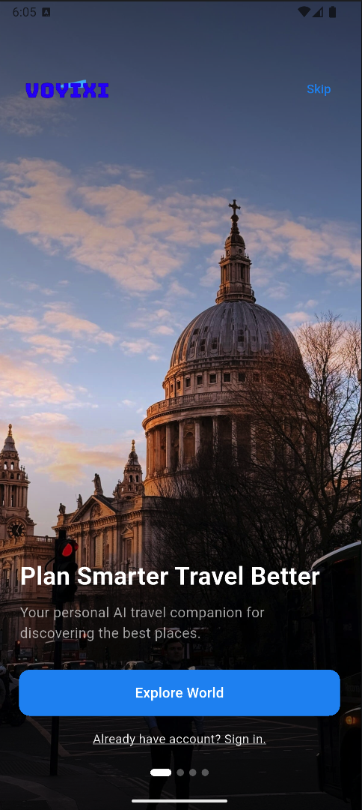
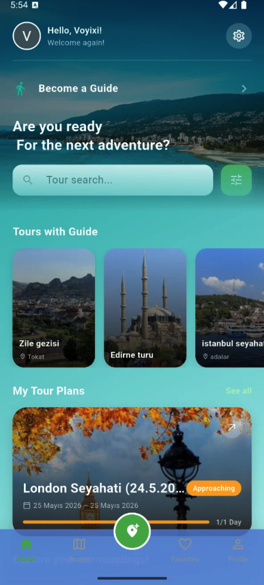
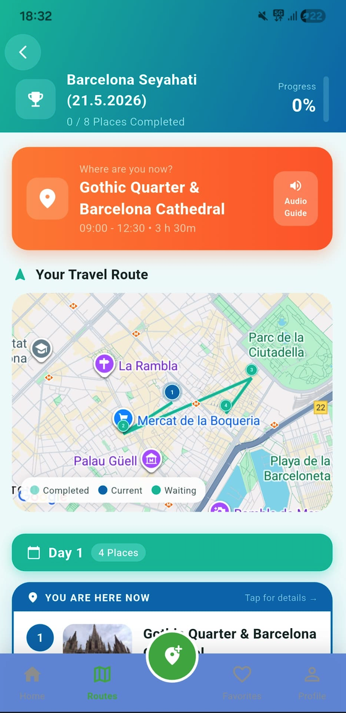
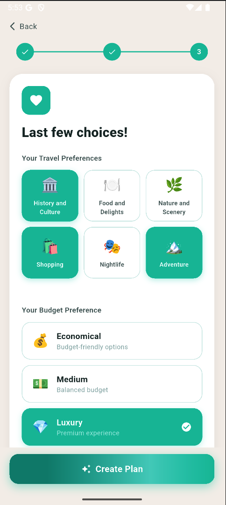
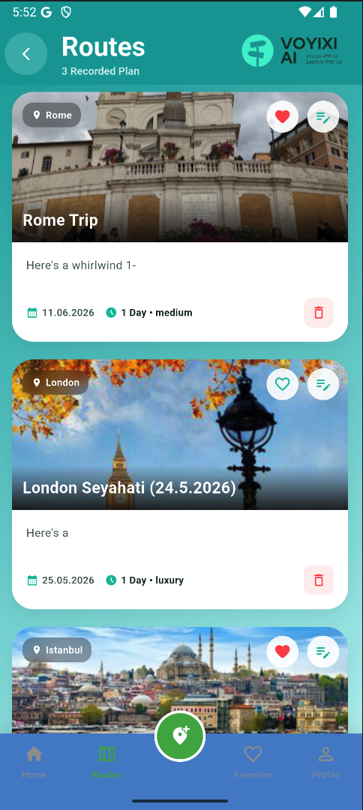
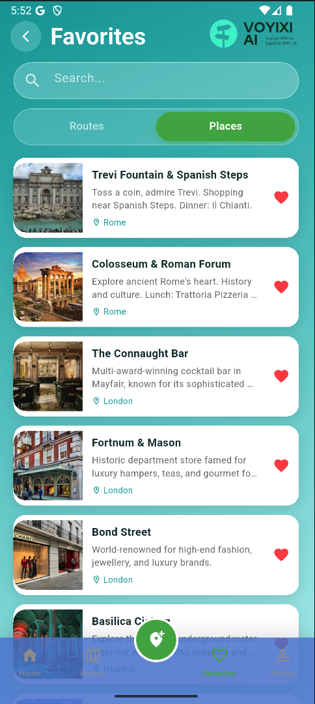
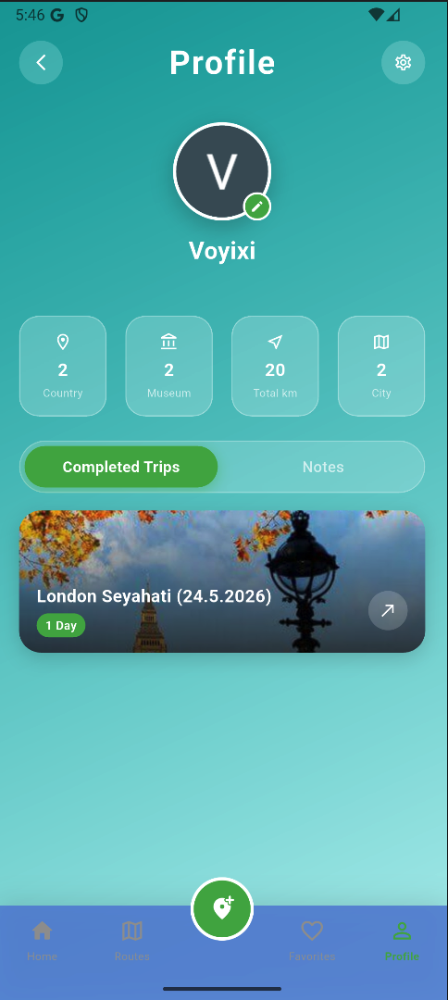
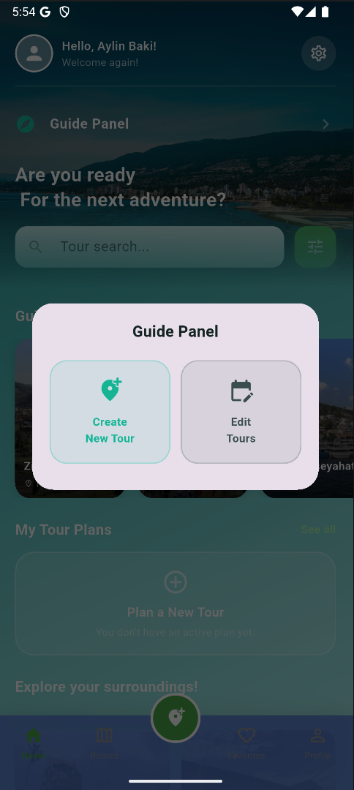

<div align="center">

# 🧭 Voyixi — AI-Powered Personalized Travel Planning

**An AI travel assistant that turns fragmented trip planning into a single, adaptive experience.**

[](https://flutter.dev)
[](https://firebase.google.com)
[](https://ai.google.dev)
[]()

**Aylin Baki · Semih Özkara** — Bachelor's Project, Işık University CS&E (Spring 2026)


</div>

---

## Overview

Planning a trip usually means switching between a maps app, a review site, and a guide-booking service — none of which talk to each other. **Voyixi** unifies this into one Flutter app: tell it your destination, duration, budget, and interests, and it generates a full day-by-day itinerary using **Google Gemini**, then helps you live through it with real-time crowd indicators, AI audio narration, a local guide marketplace, and a digital travel memory log.

## Key Features

- 🧠 **AI Itinerary Generation** — structured LLM prompting → day-by-day plan in strict JSON
- 🗺️ **Live Route Navigation** — interactive map with completed/active/upcoming stops
- 👥 **Crowd-Level Estimation** — heuristic model (based on place popularity + time of day), no live sensors needed
- 🔊 **AI Voice Narration** — on-demand, tap-to-play audio guide per landmark
- 🧑‍🏫 **Local Guide Marketplace** — guides publish tours, travelers browse & contact
- 🗂️ **Digital Travel Memory** — visited places, notes, photos, lifetime stats
- 🔐 **Firebase Auth** — email/password + Google Sign-In

## Architecture

Four subsystems: **Mobile UI (Flutter)** ↔ **AI Engine (Gemini via OpenRouter)** ↔ **Backend (Firebase Auth + Firestore)** ↔ **Geospatial Layer (Google Maps/Places)**.

The AI engine builds a structured prompt from onboarding inputs (`city`, `days`, `budget`, `preferences`) and requires Gemini to return a strict JSON schema — this same pipeline is reused for narration text and alternate-stop regeneration.

## Notable Engineering Decisions

- **Crowd density:** no affordable live-sensor API existed at student-project scale → built a heuristic estimator from Google Places' review volume + time-of-day, shown as *Calm/Medium/Busy* rather than a live number.
- **Voice narration trigger:** originally auto-played via GPS geofencing; unreliable in dense cities, so switched to a manual tap-to-play trigger.
- **Itinerary quality:** getting geographically sound, realistically paced plans out of the LLM took significant prompt iteration.

## Tech Stack

**Frontend:** Flutter 3.8.0 / Dart
**Backend:** Firebase Auth, Cloud Firestore
**AI:** Google Gemini (via OpenRouter)
**Maps:** Google Maps Platform, `geolocator`, `url_launcher`
**Other:** `just_audio`, `image_picker`, `flutter_dotenv`

## Screenshots

<table align="center">
  <tr>
    <td align="center"><b>Onboarding</b></td>
    <td align="center"><b>Home</b></td>
    <td align="center"><b>AI Trip Planner</b></td>
    <td align="center"><b>Trip Maker</b></td>
  </tr>
  <tr>
    <td></td>
    <td></td>
    <td></td>
    <td></td>
  </tr>
</table>

<table align="center">
  <tr>
    <td align="center"><b>Live Route</b></td>
    <td align="center"><b>Favorites</b></td>
    <td align="center"><b>Profile</b></td>
    <td align="center"><b>Guide Marketplace</b></td>
  </tr>
  <tr>
    <td></td>
    <td></td>
    <td></td>
    <td></td>
  </tr>
</table>


## Getting Started

```bash
git clone https://github.com/<your-username>/voyixi.git
cd voyixi
flutter pub get
# add Firebase / Google Maps / Gemini keys via .env (flutter_dotenv)
flutter run
```

> Currently Android-only, English UI.

---

<div align="center">


</div>
